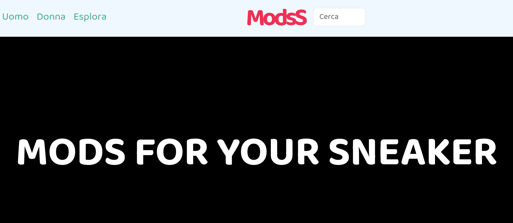

# Mods Sneakers




##
- [Come usare](#come-usare)
- [Ispirazione](#ispirazione)
- [TODO](#todo)
- [Crediti](#crediti)


## Come usare   

- Metodo ⚡:

  1\. scaricare ed estrarre [mods-sneakers-dockerized.zip](https://github.com/alessio-bonanno/mods-sneakers/releases/download/1.0.0/mods-sneakers-dockerized.zip)

  2\.
  ```bash
    cd mods-sneakers-dockerized
    docker load -i mods-sneakers-image.zip
    docker-compose up
    ```
  3\. aprire [localhost:5500](http://localhost:5500)

- Metodo 💤
  
    Requisiti:

    - [front-end](https://github.com/alessio-bonanno/mods-sneakers/archive/refs/heads/facciata.zip)
    - [back-end](https://github.com/alessio-bonanno/mods-sneakers/archive/refs/heads/didietro.zip)
    - [file .sql](https://github.com/alessio-bonanno/mods-sneakers/releases/download/1.0.0/database.sql) per la creazione del database
    - (Opzionale se si vuole soffrire) [XAMPP](https://www.apachefriends.org/download.html)

1. Creare il database usando il [file .sql]() (es: importarlo da phpMyAdmin)

2. Avviare il front-end usando un server http (es: usando python SimpleHTTPServer)

```bash
  cd mods-sneakers-facciata
  python3 -m http.server 5500
```
  
3. Avviare il back-end usando uvicorn (es: Linux/WSL)
  
```bash
  cd mods-sneakers-didietro
  pip3 install -r requirements.txt
  python3 -m venv venv
  source venv/bin/activate
  uvicorn main:app
```

4. Aprire [localhost:5500](http://localhost:5500)

**_NOTA_:** si decida di non usare il container, sarà necessario cambiare la chiave `host` in [middleware.py](https://github.com/alessio-bonanno/mods-sneakers/blob/didietro/db/middleware.py) per rispecchiare l'ip dove è hostato il server MySQL


## Ispirazione

Un giorno (lontano) vidi, per puro caso, una persona con addosso delle scarpe. Capì subito il modello: Nike Air Jordan 1. Però il colorway (i colori della scarpa) mi sembrò molto strano. Decisi allora di provare a trovare qualcosa sull'Internet. Sito Nike, niente. StockX, niente. Articoli random provando a cercare i colori della scarpa, niente. Articoli random provando a cercare i colri della scarpa in Inglese, niente. Ad una certa però, neanche io sapendo come, mi ritrovai su un sito, che spiegava come "moddare" le proprie Jordan 1. Da qui scoprì un mondo completamente nuovo, fatto di colori (delle scarpe). Scoprì anche che QUEL colorway, era, addirittura, uno abbastanza comune, con vari tutorial sopra.

Perché raccontare questo? Beh, l'epifania mi venne una volta che mi fu detto che avrei dovuto creare un sito web...

E allora, perché non crearlo su questa nicchia. Così nasce ModsS. C'è da dire però che deve ancora diventare grande. Questo perché, all'inizio, me l'immaginai come un vero e proprio marketplace, stile StockX, però adesso sembra più un listing di scarpe. Per adesso si possono solamente scegliere i vari colori delle componenti di un solo modello di scarpa. Sicuramente dovrò aggiungere la possibilità di farlo per più scarpe, poter cambiare i materiali della scarpa, e avere delle "texture" personallizabili. [Questo](https://i.pinimg.com/736x/40/fa/26/40fa26dd737c039d2bde6a1b24fddd68.jpg) è un vero esempio di una sneaker moddata. Solamente così si potrà diventare grandi.


<a id="todo"></a>
## TODO(s)
 - controlli server-side. Buona parte sono fatti client-side
 - pannello per cambiare le impostazioni dell'account
 - tema scuro
 - aggiungere più mod
 - pannello scarpe vendute
 - ordinare le chiavi delle risposte. per adesso sono in ordine semi-casuale (es: l'id potrebbe non essere la prima chiave)
 - fix: alcune immagini prese dall'api sono specchiate e hanno un colore di sfondo
 - implementare [<model-viewer\>](https://modelviewer.dev/) per ogni prodotto, con diverse texture per rappresentare i vari colori


<a id="crediti"></a>
## Crediti (cose a cui ho fatto Ctrl-C + Ctrl-V)

- [/api/v1/shoe](https://www.sneakerjagers.com/)

- [Email regex](https://www.regexr.com/3e48o)

- [SVG con colore](https://dev.to/hasantezcan/how-to-colorize-svg-image-1kc8)

- [Ispirazione per l'animazione dei prodotti in /listing](https://www.google.com/search?q=cosa%20guardare)

- /media/mods/*
  - [AIObot](https://www.aiobot.com/parts-of-a-shoe)
  - [Sole Supplier](https://thesolesupplier.co.uk/news/lesson-in-sneaker-anatomy-with-the-air-jordan-1-mid-gs-sneaker-school)
  - [McKICKZ](https://mckickz.co.uk/products/air-jordan-1-mid-gs-schematic-dq1864-100)
  - [Jasper Chou Medium](https://medium.com/add-space/in-depth-sneaker-review-nike-air-jordan-1-retro-high-travis-scott-6115c4339908)
  - [Angelus Direct](https://angelusdirect.com/products/white-jordan-1-replacement-shoelaces)

- [/media/transition.mp4](https://www.vecteezy.com/members/zegerstock)

- [/media/cart.svg](https://www.flaticon.com/free-icon/shopping-cart_3002254)

- [/media/logout.svg](https://www.flaticon.com/free-icon/arrow_16567177)

- [/media/plus.svg](https://www.flaticon.com/free-icon/plus_3524388)

- [/media/minus.svg](https://www.flaticon.com/free-icon/minus_1828901)

- [/media/navbar-menu.svg](https://icons8.it/icon/68555/menu)